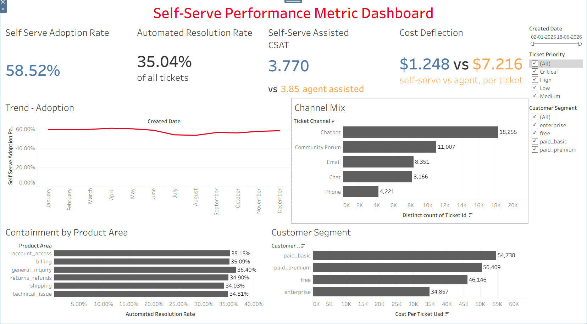

# Self-Serve Support & Automation Analytics

A self-directed analytics project built to explore the kind of problems a
Support Operations analytics function deals with: self-serve adoption,
automated resolution rate, cost deflection, and CSAT trade-offs between
self-serve and agent-assisted support.

**Live Dashboard Link:** https://public.tableau.com/app/profile/surbhi.rathi/viz/PinterestCSATDashboard/CSATDashboard

**Why this exists:** I built this to see what how to calculate performance through metrics for 
customer support ticketing system using AI chatbots to check for
self-serve support, automation, and tooling analytics. Real
company ticket data isn't publicly available at the grain or detail needed
to demonstrate this kind of work, so I generated a synthetic dataset modeled
on realistic support-operations patterns and used it to practice the full
workflow: schema design → data generation → metric definition → dashboard
build → insight write-up.

> **Note on the data:** All ticket data in this repo is synthetically
> generated (see `scripts/generate_dataset.py`). It is designed to mirror
> realistic distributions and relationships you'd see in real support
> operations data, but it is not real company data.

---

## Project structure

```
.
├── data/
│   └── sample_tickets_1000.csv      # 1,000-row sample for quick inspection
├── scripts/
│   └── generate_dataset.py          # Generates the full 50,000-row dataset
├── docs/
│   └── METRIC_DEFINITIONS.md        # KPI formulas, grain, and caveats
├── assets/
│   └── dashboard_preview.png        # Dashboard screenshot
└── README.md
```

The full 50,000-row dataset is included in the data folder

---

## Dataset

**Grain:** One row per `ticket_id`. 50,000 rows spanning Jan 2025–Jun 2026.

| Field | Description |
|---|---|
| `ticket_id` | Unique identifier |
| `created_date`, `created_timestamp` | When the ticket was opened |
| `ticket_type`, `ticket_subject`, `ticket_description` | What the ticket is about |
| `ticket_status` | Open, Closed, Pending Customer Response |
| `resolution` | Resolution text (populated only when closed) |
| `ticket_priority` | Low, Medium, High, Critical |
| `ticket_channel` | Chatbot, Community Forum, Chat, Email, Phone |
| `is_self_serve` | Boolean — true for Chatbot/Community Forum |
| `product_area`, `customer_segment` | Billing, shipping, technical issue, etc. / free, paid_basic, paid_premium, enterprise |
| `resolution_outcome` | resolved_bot, resolved_agent, escalated_to_agent, unresolved, abandoned, reopened_case |
| `resolved_by_automation` | Boolean — drives automated resolution rate |
| `first_response_time_minutes`, `time_to_resolution_minutes` | Speed metrics |
| `cost_per_ticket_usd` | Channel-weighted cost, with an enterprise multiplier reflecting dedicated agent/CSM handling |
| `customer_satisfaction_rating`, `csat_responded` | CSAT score (1–5) and survey response flag |
| `reopened` | Boolean — ticket reopened after resolution |
| `country`, `device_type` | Supporting dimensions |

Full KPI formulas and caveats are documented in
[`docs/METRIC_DEFINITIONS.md`](docs/METRIC_DEFINITIONS.md).

---

## Dashboard



**KPIs tracked:**
- Self-serve adoption rate
- Automated resolution rate
- Self-serve CSAT (vs. agent-assisted CSAT)
- Cost per ticket, self-serve vs. agent-assisted, including a segment-level
  view that captures enterprise's higher cost-to-serve

**Supporting views:**
- Monthly self-serve adoption trend
- Ticket volume by channel
- Bot containment rate by product area
- Cost per ticket by customer segment

---

## Key findings (from the synthetic dataset)

1. **Self-serve adoption rose from ~52% to ~62%** over the 18-month window,
   but containment in shipping and technical-issue categories still trails
   general inquiries by ~2 points — the clearest signal of where to invest
   in better self-serve flows next.
2. **Self-serve tickets cost ~$1.25 on average vs. ~$7.22 for agent-assisted**
   — a ~5.8x differential that makes a strong case for closing the
   containment gap above.
3. **Self-serve CSAT (3.77) runs slightly below agent-assisted CSAT (3.85)**
   — a reminder that deflection savings come with a real (if modest)
   experience trade-off that should be monitored as adoption scales further.

---

## How this was built

1. Defined the target KPIs first.
2. Designed a ticket-level schema that could support all KPIs plus
   diagnostic metrics.
3. Built calculated fields and visualizations in Tableau, applying basic
   dashboard design principles: one accent color used for signal (not
   decoration), consistent KPI card grid, chart subtitles for
   self-documentation, and a written takeaway tied to the data.
4. Documented every metric definition so the dashboard is interpretable
   without relying on tribal knowledge.

---

## Tools used

Python (numpy, pandas) for data generation · Tableau for the dashboard ·
Markdown for documentation.
